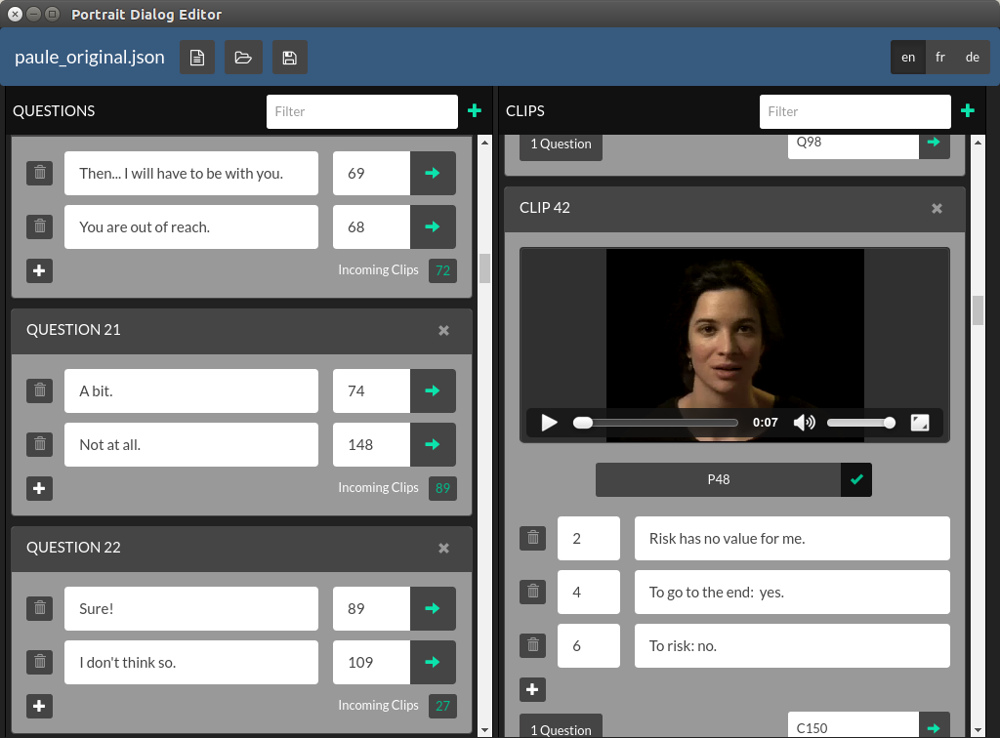

# Portrait Dialog Editor

An editor for Portrait dialogues. Should produce files compatible with the format used in portrait-one.



## Installing and Running in Development Mode

First, pull down the dependencies from `npm`:

```bash
$ npm install
```

Now run:

```bash
$ npm run dev
```

#### Toggle Chrome DevTools

- OS X: <kbd>Cmd</kbd> <kbd>Alt</kbd> <kbd>I</kbd> or <kbd>F12</kbd>
- Linux: <kbd>Ctrl</kbd> <kbd>Shift</kbd> <kbd>I</kbd> or <kbd>F12</kbd>
- Windows: <kbd>Ctrl</kbd> <kbd>Shift</kbd> <kbd>I</kbd> or <kbd>F12</kbd>

*See [electron-debug](https://github.com/sindresorhus/electron-debug) for more information.*

#### Toggle Redux DevTools

- All platforms: <kbd>Ctrl+H</kbd>

*See [redux-devtools-dock-monitor](https://github.com/gaearon/redux-devtools-dock-monitor) for more information.*

## Building Standalone

To build for your platform, run

```bash
$ npm run package
```

To build for all platforms, run

```bash
$ npm run package-all
```
